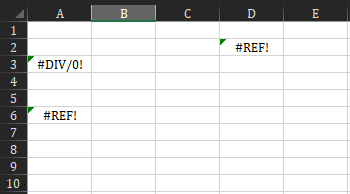
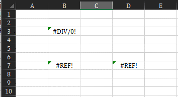

# WorkbookExtensions

Methods and functions for the Workbook and Worksheet objects.

## Methods & Functions

|                                             | Type      | Description                                                                          |
|---------------------------------------------|-----------|--------------------------------------------------------------------------------------|
| [`WorksheetErrors`](#worksheeterrors)       | `Variant` | Gets all of the cells that have errors in a Worksheet, i.e. `#DIV/0!`, `#REF!`, etc. |
| [`WorkbookErrors`](#workbookerrors)         | `Variant` | Gets all of the errors in a Workbook, i.e. `#DIV/0!`, `#REF!`, etc.                  |
| [`WorksheetHasErrors`](#worksheethaserrors) | `Boolean` | Checks if a Worksheet contains any errors, i.e. `#DIV/0!`, `#REF!`, etc.             |
| [`UnhideAllSheets`](#unhideallsheets)       |           | Unhides all sheets in a Workbook.                                                    |
| [`UnhideSheets`](#unhidesheets)             |           | Unhide Worksheet(s).                                                                 |
| [`HideSheets`](#hidesheets)                 |           | Hide Worksheet(s).                                                                   |


---

### `WorksheetErrors`

Gets all of the ranges (cells) that has errors in a Worksheet, i.e. `#DIV/0!`, `#REF!`, etc.

**Parameters**
- `ByRef WorkSh As Worksheet`
    - The worksheet to examine.
- `Optional ErrorContainer As Variant`
    - The error container. 
    - You can reuse this container to append errors to it.

**Returns**
- `Variant`: All the errors found in a worksheet.


**Usage**

<p align="center"><sub><b>Sheets 1 & 2</b></sub></p>  

<p align="center">

</p>


<p align="center"><sub><b>VBA</b></sub></p>


```vb
Private Sub Demo()
    Dim ErrorContainer As Variant
    Dim i As Long
    
    ErrorContainer = WorksheetErrors(ActiveWorkbook.Sheets(1), ErrorContainer)
    ErrorContainer = WorksheetErrors(ActiveWorkbook.Sheets(2), ErrorContainer)

    Debug.Print "Sheet", "Address", "Value", "Formula"
    Debug.Print "-------------------------------------------------------"
    For i = LBound(ErrorContainer) To UBound(ErrorContainer)
        Debug.Print ErrorContainer(i).Worksheet.Name, ErrorContainer(i).Address, ErrorContainer(i).Value, ErrorContainer(i).Formula
    Next
End Sub
```

<p align="center"><sub><b>Output</b></sub></p>


```
Sheet         Address       Value         Formula
-------------------------------------------------------
Sheet1        $D$2          Error 2023    =#REF!
Sheet1        $A$3          Error 2007    =1/0
Sheet1        $A$6          Error 2023    =#REF!
Sheet2        $B$7          Error 2023    =#REF!
Sheet2        $D$7          Error 2023    =#REF!
Sheet2        $B$3          Error 2007    =1/0
```


---


### `WorkbookErrors`

Gets all of the errors in a Workbook, i.e. `#DIV/0!`, `#REF!`, etc.

**Parameters**
- `ByRef WorkSh As Worksheet`
    - The worksheet to examine.

**Returns**
- `Variant`: All of the errors in the workbook.


**Usage**

<p align="center"><sub><b>Sheets 1 & 2</b></sub></p>  

<p align="center">

</p>


<p align="center"><sub><b>VBA</b></sub></p>

```vb
Private Sub Demo()
    Dim ErrorContainer As Variant
    Dim i As Long
    
    ErrorContainer = WorkbookErrors(ActiveWorkbook)
    
    Debug.Print "Sheet", "Address", "Value", "Formula"
    Debug.Print "-------------------------------------------------------"
    For i = LBound(ErrorContainer) To UBound(ErrorContainer)
        Debug.Print ErrorContainer(i).Worksheet.Name, ErrorContainer(i).Address, ErrorContainer(i).Value, ErrorContainer(i).Formula
    Next
End Sub
```

<p align="center"><sub><b>Output</b></sub></p>


```
Sheet         Address       Value         Formula
-------------------------------------------------------
Sheet1        $D$2          Error 2023    =#REF!
Sheet1        $A$3          Error 2007    =1/0
Sheet1        $A$6          Error 2023    =#REF!
Sheet2        $B$7          Error 2023    =#REF!
Sheet2        $D$7          Error 2023    =#REF!
Sheet2        $B$3          Error 2007    =1/0
```


---


### `WorksheetHasErrors`


Checks if a Worksheet contains any errors, i.e. `#DIV/0!`, `#REF!`, etc.

**Parameters**
- `ByRef WorkSh As Worksheet`
    - The worksheet to examine.

**Returns**
- `Boolean`: Whether or not the sheet contains errors.


**Usage**

<p align="center"><sub><b>Sheets 1</b></sub></p>  

<p align="center">

</p>


<p align="center"><sub><b>VBA</b></sub></p>  

```vb
Private Sub Demo()
    Debug.Print WorksheetHasErrors(ActiveWorkbook.Sheets(1))
End Sub
```

<p align="center"><sub><b>Output</b></sub></p>

```
True
```


---


### `UnhideAllSheets`

Unhides all sheets in a Workbook.

**Parameters**
- `Optional ByRef WorkBk As Workbook`
    - The workbook to target. Will target the active workbook is no value is provided.


**Usage**

<p align="center"><sub><b>VBA</b></sub></p>

```vb
Private Sub Demo()
    UnhideAllSheets ActiveWorkbook
End Sub
```


---


### `UnhideSheets`

Unhides all sheets in a workbook.

**Parameters**
- `ParamArray Items() As Variant`
    - The Worksheet(s) to unhide.


**Usage**

<p align="center"><sub><b>VBA</b></sub></p>

```vb
Private Sub Demo()
    UnhideSheets ActiveWorkbook.Sheets(1), ActiveWorkbook.Sheets(2)
End Sub
```


---


### `HideSheets`

Hide Worksheet(s).

**Parameters**
- `ParamArray Items() As Variant`
    - The Worksheet(s) to hide.

**Usage**

<p align="center"><sub><b>VBA</b></sub></p>

```vb
Private Sub Demo()
    HideSheets ActiveWorkbook.Sheets(1), ActiveWorkbook.Sheets(2)
End Sub
```
